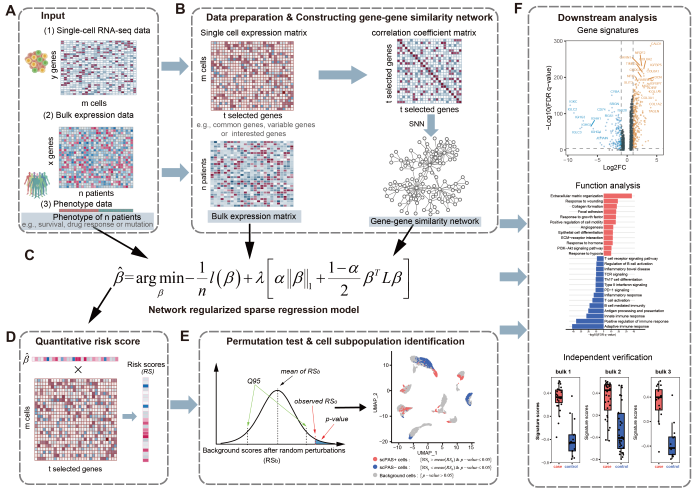

# scPAS: Single-Cell Phenotype-Associated Subpopulation Identifier

<!-- badges: start -->
[](https://zaoqu-liu.r-universe.dev/scPAS)
[](https://github.com/Zaoqu-Liu/scPAS)
[](https://www.r-project.org/)
[](https://www.gnu.org/licenses/gpl-3.0)
[](https://doi.org/10.1093/bib/bbae655)
[](https://zaoqu-liu.github.io/scPAS/)
<!-- badges: end -->

## Overview

**scPAS** is a computational framework for identifying phenotype-associated cell subpopulations from single-cell RNA sequencing (scRNA-seq) data through the integration of bulk transcriptomic profiles and clinical phenotypes. The methodology employs network-regularized sparse regression to quantify the strength of association between individual cells and phenotypic outcomes, enabling both quantitative scoring and statistical inference at single-cell resolution.

<p align="center">
  
</p>

## Methodological Framework

### Statistical Model

scPAS implements the **Augmented and Penalized Minimization with L0 (APML0)** algorithm, which combines:

- **L1 regularization** (LASSO) for sparsity
- **Laplacian regularization** for incorporating gene network structure
- **Cross-validation** for optimal parameter selection

### Supported Regression Families

| Family | Phenotype Type | Application |
|--------|----------------|-------------|
| **Gaussian** | Continuous | Age, BMI, gene expression levels |
| **Binomial** | Binary | Case-control, treatment response |
| **Cox** | Time-to-event | Overall survival, progression-free survival |

### Statistical Inference

Significance is assessed through permutation testing with FDR correction (Benjamini-Hochberg). Cells are classified as:

- **scPAS+**: Positively associated (risk score > 0, FDR < threshold)
- **scPAS-**: Negatively associated (risk score < 0, FDR < threshold)  
- **Non-significant**: FDR >= threshold

## Installation

### From R-universe (Recommended)

```r
install.packages("scPAS", repos = c(
  "https://zaoqu-liu.r-universe.dev",
  "https://cloud.r-project.org"
))
```

### From GitHub

```r
if (!require("devtools")) install.packages("devtools")
devtools::install_github("Zaoqu-Liu/scPAS")
```

### Dependencies

```r
# Bioconductor dependency
if (!require("BiocManager")) install.packages("BiocManager")
BiocManager::install("preprocessCore")

# Optional: parallel computing
install.packages(c("future", "future.apply"))
```

## Documentation

Comprehensive documentation: **[https://zaoqu-liu.github.io/scPAS/](https://zaoqu-liu.github.io/scPAS/)**

| Vignette | Description |
|----------|-------------|
| [Quick Start](https://zaoqu-liu.github.io/scPAS/articles/quick-start.html) | Basic usage and workflow |
| [Algorithm](https://zaoqu-liu.github.io/scPAS/articles/algorithm.html) | Mathematical methodology |
| [Visualization](https://zaoqu-liu.github.io/scPAS/articles/visualization.html) | Publication-quality figures |
| [Survival Analysis](https://zaoqu-liu.github.io/scPAS/articles/case-survival.html) | Cox regression application |
| [Binary Classification](https://zaoqu-liu.github.io/scPAS/articles/case-binary.html) | Treatment response prediction |

## Quick Start

```r
library(scPAS)
library(Seurat)

# Run scPAS analysis
result <- scPAS(
  bulk_dataset = bulk_expression,
  sc_dataset = seurat_object,
  phenotype = phenotype_vector,
  family = "gaussian",
  nfeature = 3000,
  permutation_times = 1000,
  n_cores = 4
)

# Extract significant cells
significant_cells <- subset(result, subset = scPAS_FDR < 0.05)
table(significant_cells$scPAS)
```

## Output Structure

| Column | Description |
|--------|-------------|
| `scPAS_RS` | Raw risk score |
| `scPAS_NRS` | Normalized risk score (Z-statistic) |
| `scPAS_Pvalue` | Permutation-based p-value |
| `scPAS_FDR` | Benjamini-Hochberg adjusted p-value |
| `scPAS` | Cell classification (scPAS+/scPAS-/0) |

## Key Features

- **Multi-modal Integration**: Bridges bulk and single-cell transcriptomics
- **Network Regularization**: Incorporates gene-gene co-expression structure
- **Flexible Phenotypes**: Supports continuous, binary, and survival outcomes
- **Scalable Computation**: Parallel processing for large-scale datasets
- **Seurat Integration**: Native support for Seurat v4 objects

## Citation

If you use scPAS in your research, please cite:

> Xie A, Wang H, Zhao J, Wang Z, Xu J, Xu Y. **scPAS: single-cell phenotype-associated subpopulation identifier.** *Briefings in Bioinformatics*. 2024;26(1):bbae655. DOI: [10.1093/bib/bbae655](https://doi.org/10.1093/bib/bbae655)

## Authors

- **Aimin Xie** - Original algorithm development
- **[Zaoqu Liu](https://orcid.org/0000-0002-0452-742X)** - Package maintenance (liuzaoqu@163.com)

## License

GPL-3.0 | [GNU General Public License v3.0](https://www.gnu.org/licenses/gpl-3.0.html)
